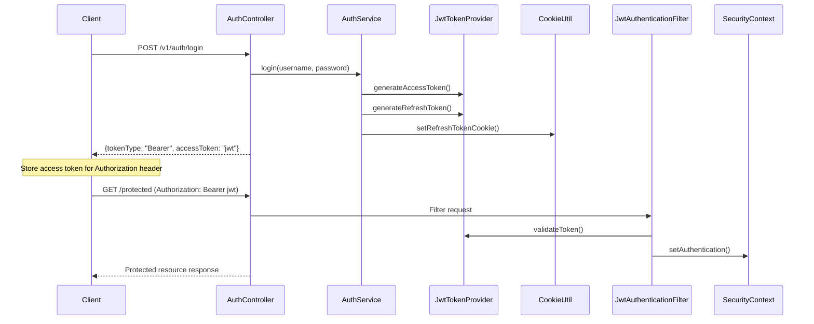

# Design Document

## Overview

This design document outlines the improvements to the existing login system to implement a more secure and standard-compliant authentication flow. The key changes involve:

1. Returning access tokens in response body instead of cookies
2. Maintaining refresh tokens as HTTP-only cookies
3. Updating authentication verification to prioritize Authorization headers
4. Ensuring backward compatibility during transition

The design leverages the existing JWT infrastructure while modifying the token delivery and verification mechanisms.

## Architecture

### Current Architecture
- Both access and refresh tokens are stored as HTTP-only cookies
- JwtAuthenticationFilter reads tokens from cookies
- AuthController returns TokenResponse with token information
- CookieUtil manages cookie operations

### New Architecture
- Access tokens returned in response body with format `{tokenType: "Bearer", accessToken: "jwt"}`
- Refresh tokens remain as HTTP-only cookies
- JwtAuthenticationFilter prioritizes Authorization header, falls back to cookies
- Enhanced TokenResponse format for client consumption
- Backward compatibility maintained for existing cookie-based clients

### Authentication Flow Diagram



## Components and Interfaces

### 1. Enhanced TokenResponse DTO

**Purpose**: Standardize token response format for client consumption

**Changes**:
- Ensure consistent structure across all authentication endpoints
- Remove unnecessary fields that should not be exposed to clients
- Add clear tokenType field set to "Bearer"

### 2. Modified AuthController

**Purpose**: Update authentication endpoints to return tokens in response body

**Key Changes**:
- Login endpoint returns access token in body, sets refresh token cookie
- Refresh endpoint returns new access token in body
- OAuth2 success handler follows same pattern
- Maintain backward compatibility

**New Response Format**:
```json
{
  "tokenType": "Bearer",
  "accessToken": "eyJhbGciOiJIUzI1NiIsInR5cCI6IkpXVCJ9..."
}
```

### 3. Enhanced JwtAuthenticationFilter

**Purpose**: Support both Authorization header and cookie-based authentication

**Authentication Priority**:
1. Authorization header (Bearer token) - Primary method
2. Cookie-based access token - Fallback for backward compatibility

**Token Extraction Logic**:
```java
private String getTokenFromRequest(HttpServletRequest request) {
    // Priority 1: Authorization header
    String bearerToken = request.getHeader("Authorization");
    if (StringUtils.hasText(bearerToken) && bearerToken.startsWith("Bearer ")) {
        return bearerToken.substring(7);
    }
    
    // Priority 2: Cookie (backward compatibility)
    Cookie[] cookies = request.getCookies();
    if (cookies != null) {
        for (Cookie cookie : cookies) {
            if (TokenConstants.ACCESS_TOKEN_COOKIE.equals(cookie.getName())) {
                return cookie.getValue();
            }
        }
    }
    
    return null;
}
```

### 4. Updated AuthService

**Purpose**: Modify token creation and response handling

**Key Changes**:
- Remove access token cookie setting from login methods
- Ensure refresh token is properly set as cookie
- Update token refresh logic to return proper response format

### 5. Enhanced CookieUtil

**Purpose**: Manage refresh token cookies while removing access token cookie operations

**Changes**:
- Remove access token cookie methods from public interface
- Maintain refresh token cookie operations
- Update logout to only clear refresh token cookies

## Data Models

### TokenResponse Enhancement

```java
@Data
@Builder
@NoArgsConstructor
@AllArgsConstructor
public class TokenResponse {
    /** Token type - always "Bearer" */
    private String tokenType;
    
    /** JWT access token */
    private String accessToken;
    
    // Remove fields that shouldn't be exposed to clients:
    // - expiresIn (can be derived from JWT)
    // - userId (available in JWT claims)
    // - username (available in JWT claims)
    // - role (available in JWT claims)
}
```

### Login Response Structure

For endpoints that need to return both tokens:
```java
// Internal use - not exposed to clients
@Data
@Builder
public class LoginResponse {
    private TokenResponse tokenResponse;
    private String refreshToken; // Used internally for cookie setting
}
```

## Error Handling

### Authentication Errors

1. **Invalid Authorization Header**
   - Status: 401 Unauthorized
   - Message: "Invalid or missing Authorization header"

2. **Expired Access Token**
   - Status: 401 Unauthorized
   - Message: "Access token has expired"
   - Client should use refresh token to get new access token

3. **Invalid Refresh Token**
   - Status: 401 Unauthorized
   - Message: "Invalid or expired refresh token"
   - Client should redirect to login

### Backward Compatibility Errors

1. **Cookie-based Authentication Deprecation Warning**
   - Log warning when cookie-based tokens are used
   - Continue processing but encourage migration to header-based auth

## Testing Strategy

### Unit Tests

1. **TokenResponse Tests**
   - Verify correct structure and field population
   - Test builder pattern functionality
   - Validate JSON serialization format

2. **JwtAuthenticationFilter Tests**
   - Test Authorization header token extraction
   - Test cookie fallback mechanism
   - Test token validation and authentication setting
   - Test error handling for invalid tokens

3. **AuthController Tests**
   - Test login endpoint response format
   - Test refresh endpoint response format
   - Test OAuth2 integration response format
   - Test error responses

4. **AuthService Tests**
   - Test token generation and response creation
   - Test refresh token logic
   - Test cookie setting behavior

### Integration Tests

1. **Authentication Flow Tests**
   - Test complete login flow with new response format
   - Test token refresh flow
   - Test protected endpoint access with Authorization header
   - Test backward compatibility with cookie-based auth

2. **Security Tests**
   - Test that refresh tokens are not exposed in response body
   - Test that access tokens are not set as cookies
   - Test proper cookie security attributes (HttpOnly, Secure)

3. **Cross-browser Compatibility Tests**
   - Test cookie handling across different browsers
   - Test Authorization header support

### Performance Tests

1. **Token Processing Performance**
   - Measure impact of dual authentication method support
   - Test token validation performance
   - Monitor memory usage with enhanced filter logic

## Security Considerations

### Access Token Security

1. **Client-side Storage**: Access tokens in response body allow clients to choose appropriate storage (memory, secure storage)
2. **Transport Security**: Tokens transmitted over HTTPS only
3. **Token Expiration**: Short-lived access tokens (30 minutes) limit exposure window

### Refresh Token Security

1. **HTTP-only Cookies**: Prevents XSS attacks from accessing refresh tokens
2. **Secure Flag**: Ensures cookies only sent over HTTPS in production
3. **SameSite Attribute**: Prevents CSRF attacks
4. **Long Expiration**: 7-day expiration balances security and user experience

### Backward Compatibility Security

1. **Gradual Migration**: Allows secure transition without breaking existing clients
2. **Priority System**: New method takes precedence over legacy method
3. **Deprecation Logging**: Tracks usage of legacy authentication for migration planning

## Migration Strategy

### Phase 1: Implementation
- Deploy new authentication logic with backward compatibility
- Update client applications to use Authorization headers
- Monitor usage patterns and error rates

### Phase 2: Client Migration
- Update frontend applications to use new token format
- Update mobile applications to use Authorization headers
- Provide migration guides for third-party integrations

### Phase 3: Legacy Deprecation
- Add deprecation warnings for cookie-based authentication
- Set timeline for removing cookie-based access token support
- Maintain refresh token cookies indefinitely

## Configuration Changes

### Application Properties

No new configuration required. Existing JWT settings remain unchanged:

```properties
jwt.secret=...
jwt.access-token-validity=1800000  # 30 minutes
jwt.refresh-token-validity=604800000  # 7 days
```

### Environment Variables

Existing cookie security settings remain relevant:

```properties
COOKIE_SECURE=true  # Production
COOKIE_SAME_SITE=Lax
```

## Monitoring and Observability

### Metrics to Track

1. **Authentication Method Usage**
   - Count of Authorization header vs cookie-based authentications
   - Migration progress tracking

2. **Token Refresh Patterns**
   - Frequency of token refresh requests
   - Success/failure rates

3. **Error Rates**
   - Authentication failures by method
   - Token validation errors

### Logging Enhancements

1. **Authentication Method Logging**
   - Log which authentication method was used
   - Track migration progress

2. **Security Event Logging**
   - Invalid token attempts
   - Suspicious authentication patterns

This design ensures a secure, standards-compliant authentication system while maintaining backward compatibility and providing a clear migration path for existing clients.