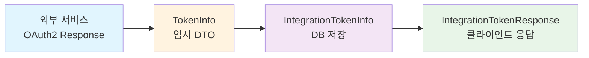

# 토큰 관련 클래스 구조 분석

## 개요
`TokenInfo.java`와 `/integration` 디렉토리의 토큰 관련 파일들이 중복되는 것처럼 보이지만, 실제로는 **서로 다른 용도와 책임**을 가지고 있습니다.

## 파일별 역할 구분

### 1. `TokenInfo.java` (oauth2/dto) - **임시 데이터 전송용**
**경로**: `src/main/java/org/example/vibelist/global/oauth2/dto/TokenInfo.java`

**용도**: 
- OAuth2 인증 과정에서 외부 서비스로부터 받아온 토큰 응답을 담는 **임시적인** DTO
- 메모리에서만 사용되고 데이터베이스에 저장되지 않음
- 외부 API 응답을 파싱하여 내부 시스템으로 전달하는 역할

**주요 특징**:
- `@Builder` 패턴으로 불변 객체 생성
- `additionalParameters`를 통한 확장 가능한 구조
- 기본적인 토큰 정보만 포함 (accessToken, refreshToken, tokenType, expiresIn, scope)

### 2. `IntegrationTokenInfo.java` (integration/entity) - **영구 저장용 엔티티**
**경로**: `src/main/java/org/example/vibelist/global/integration/entity/IntegrationTokenInfo.java`

**용도**:
- 사용자별로 외부 서비스 연동 토큰을 **데이터베이스에 영구 저장**하는 엔티티
- 토큰의 생명주기 관리 (발급, 만료, 갱신, 비활성화) 기능 포함
- 외부 서비스별 연동 상태 관리

**주요 특징**:
- JPA 엔티티로 데이터베이스 저장
- User와 연관관계 매핑 (`@ManyToOne`)
- 토큰 암호화 저장
- 토큰 만료 시간 관리 (`tokenIssuedAt`, `tokenExpiresAt`)
- 토큰 상태 관리 (`isActive`, `isValid()`, `isExpired()`)
- JSONB 형태로 추가 토큰 응답 정보 저장 (`tokenResponse`)

### 3. `IntegrationTokenResponse.java` (integration/dto) - **클라이언트 응답용**
**경로**: `src/main/java/org/example/vibelist/global/integration/dto/IntegrationTokenResponse.java`

**용도**:
- 클라이언트에게 토큰 **메타데이터만** 반환 (보안상 실제 토큰 값 제외)
- 토큰 상태 정보 위주의 응답

**주요 특징**:
- 실제 토큰 값(`accessToken`, `refreshToken`)은 포함하지 않음
- 토큰 상태 정보 위주 (`isActive`, `isValid`, `isExpired`)
- 클라이언트가 토큰 상태를 확인할 수 있는 정보 제공

## 데이터 흐름

## 처리 단계별 설명

1. **외부 서비스 토큰 수신**: OAuth2 인증을 통해 외부 서비스로부터 토큰 정보를 받음
2. **임시 객체 생성**: `TokenInfo`로 받아온 데이터를 임시 저장 및 전달
3. **영구 저장**: `IntegrationTokenInfo` 엔티티로 데이터베이스에 암호화하여 저장
4. **클라이언트 응답**: 필요시 `IntegrationTokenResponse`로 안전한 메타데이터만 클라이언트에 전달

## 설계 원칙

### 관심사 분리 (Separation of Concerns)
- **TokenInfo**: 외부 API 응답 파싱 및 임시 저장
- **IntegrationTokenInfo**: 데이터 영속성 및 생명주기 관리  
- **IntegrationTokenResponse**: 클라이언트 인터페이스 및 보안

### 보안
- `TokenInfo`: 메모리에서만 존재하는 임시 데이터
- `IntegrationTokenInfo`: 암호화된 토큰을 데이터베이스에 저장
- `IntegrationTokenResponse`: 민감한 토큰 값 제외하고 메타데이터만 노출

### 확장성
- 각 클래스가 독립적인 책임을 가져 유지보수 용이
- 새로운 외부 서비스 추가 시 기존 구조 재사용 가능

## 결론

현재 구조는 **중복**이 아닌 **적절한 관심사 분리**를 통한 설계입니다. 각 클래스가 명확한 책임을 가지고 있어 코드의 가독성과 유지보수성을 높이고 있습니다. 