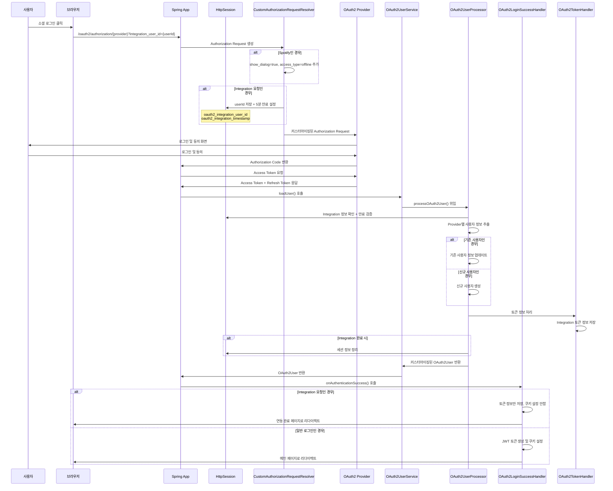
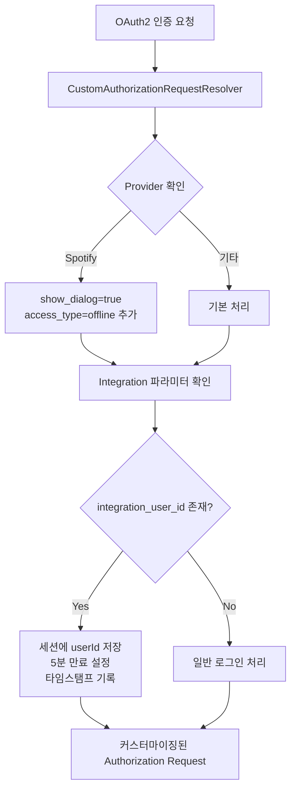
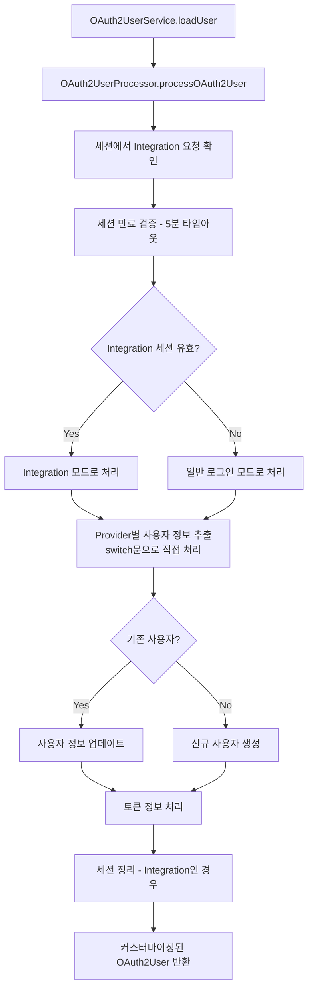
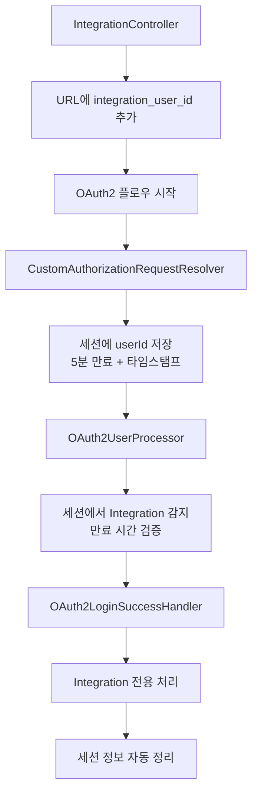

# OAuth2 Domain 전체 구조 및 플로우 (리팩토링됨)

## 개요
이 도메인은 Spring Security OAuth2를 기반으로 한 소셜 로그인 시스템을 구현합니다. 
Spotify, Google, Kakao 등 다양한 소셜 로그인 제공자를 지원하며, 특히 Spotify의 refresh token 확보와 음악 서비스 연동을 위한 특별한 처리를 포함합니다.

**리팩토링을 통해 복잡성을 대폭 줄이고 유지보수성을 향상시켰습니다.**

## 핵심 컴포넌트 (간소화됨)

### 1. 인증 요청 처리
- **CustomAuthorizationRequestResolver**: OAuth2 인증 요청 커스터마이징 (Spotify 최적화 + 세션 기반 Integration 지원)
- **CustomAuthorizationCodeTokenResponseClient**: 토큰 응답 처리 커스터마이징

### 2. 사용자 정보 처리
- **OAuth2UserService**: Spring Security의 기본 OAuth2UserService 확장
- **OAuth2UserProcessor**: OAuth2 사용자 정보 처리 및 세션 기반 Integration 로직 통합
- **SocialUserService**: 소셜 사용자 생성 및 관리 (간소화)

### 3. 토큰 관리 (통합)
- **OAuth2TokenHandler**: OAuth2 토큰 저장, 조회, 관리 통합 서비스

### 4. 인증 성공/실패 핸들러
- **OAuth2LoginSuccessHandler**: 로그인 성공 시 처리
- **OAuth2LogoutSuccessHandler**: 로그아웃 성공 시 처리

## 주요 개선사항

### ✅ 제거된 복잡성
- **Provider Strategy 패턴 제거**: 과도한 추상화를 제거하고 직접 처리 방식으로 변경
- **중복 토큰 서비스 통합**: OAuth2TokenService와 OAuth2TokenHandler를 하나로 통합
- **State 기반 처리 문제점 해결**: 안정적인 세션 기반 Integration 처리로 변경

### ✅ 간소화된 구조
- Provider별 처리 로직을 OAuth2UserProcessor 내부 메서드로 단순화
- Integration 요청을 안전한 세션 기반으로 처리하여 상태 관리 개선
- 불필요한 레이어와 추상화 제거
- 자동 세션 만료 관리 (5분)

## OAuth2 인증 플로우 (세션 기반 개선)



## 주요 처리 플로우 (세션 기반 개선)

### 1. Authorization Request 커스터마이징 (세션 기반)


### 2. 사용자 정보 처리 (세션 기반)


### 3. Integration 로직 (세션 기반)


## 파일별 상세 설명

### CustomAuthorizationRequestResolver.java (세션 기반)
- **목적**: OAuth2 Authorization Request 커스터마이징
- **주요 기능**:
  - Spotify에서 refresh token 확보를 위한 파라미터 추가
  - Integration 요청을 세션에 안전하게 저장 (5분 자동 만료)
  - Provider별 최적화된 파라미터 설정
  - 타임스탬프 기반 세션 만료 관리

### OAuth2UserProcessor.java (세션 기반 통합)
- **목적**: OAuth2 사용자 정보 처리 로직 중앙 집중화
- **주요 기능**:
  - 세션 기반 Integration 요청 감지 및 만료 검증
  - Provider별 사용자 정보 추출 (직접 switch문 처리)
  - 신규/기존 사용자 처리
  - JWT 토큰 생성 및 관리
  - Integration 완료 후 자동 세션 정리

### SocialUserService.java (간소화)
- **목적**: 소셜 사용자 생성 및 관리
- **주요 기능**:
  - 신규 소셜 사용자 생성 (User, UserProfile, Auth 통합 생성)
  - 기존 사용자 조회
  - Auth 정보 업데이트 (JWT 리프레시 토큰용)
  - 연동 중복 검증

### OAuth2TokenHandler.java (통합 서비스)
- **목적**: OAuth2 토큰 통합 관리
- **주요 기능**:
  - Integration 토큰 정보 저장
  - Spotify 전용 토큰 처리
  - OAuth2AuthorizedClient 기반 토큰 조회
  - 통합 토큰 정보 조회

## 특별한 처리 사항

### Spotify 특화 처리
1. **Refresh Token 확보**: `show_dialog=true`, `access_type=offline` 파라미터 추가
2. **직접 토큰 요청**: CustomAuthorizationCodeTokenResponseClient를 통한 직접 처리
3. **특별한 토큰 핸들링**: additionalParameters에서 토큰 정보 추출

### Integration vs 일반 로그인 (세션 기반)
1. **URL 파라미터**: Integration 요청 시 `integration_user_id` 파라미터 사용
2. **세션 기반 처리**: 안전한 HttpSession으로 정보 전달 및 자동 만료 관리
3. **토큰 저장**: Integration 시 토큰 정보만 저장, 쿠키 설정 안함
4. **리다이렉트**: 요청 타입에 따른 다른 페이지 리다이렉트
5. **보안**: 세션 기반으로 state 조작 공격 방지

## 음악 서비스 연동(Integration) 상세 설명

### 연동 시스템 개요
이 OAuth2 시스템은 단순한 소셜 로그인뿐만 아니라 **음악 서비스 연동**을 지원합니다. 
사용자가 이미 로그인된 상태에서 Spotify 등의 음악 서비스를 추가로 연동할 수 있는 기능을 제공합니다.

### 연동 vs 일반 로그인 차이점 (세션 기반)

| 구분 | 일반 로그인 | 음악 서비스 연동 |
|------|-------------|------------------|
| **목적** | 사용자 인증 및 로그인 | 기존 사용자에게 음악 서비스 추가 |
| **JWT 토큰** | 생성하여 쿠키에 저장 | 생성하지 않음 |
| **토큰 저장** | 일반적인 OAuth2 토큰 처리 | IntegrationTokenInfo 테이블에 저장 |
| **리다이렉트** | 메인 페이지 (main.html) | 연동 완료 페이지 |
| **요청 방식** | 일반 OAuth2 플로우 | URL에 `integration_user_id` 포함 |
| **상태 관리** | 세션 불필요 | 안전한 HttpSession (5분 자동 만료) |
| **보안** | 표준 OAuth2 보안 | 세션 기반 상태 보호 + 자동 정리 |

### 연동 플로우 (세션 기반 개선)

```mermaid
flowchart TD
    A[로그인된 사용자] --> B[음악 서비스 연동 요청]
    B --> C[/oauth2/authorization/spotify?integration_user_id={userId}]
    C --> D[CustomAuthorizationRequestResolver]
    D --> E[integration_user_id 감지]
    E --> F[세션에 userId 저장<br/>5분 만료 + 타임스탬프]
    F --> G[Spotify 인증 진행]
    G --> H[OAuth2UserProcessor]
    H --> I[세션에서 integration 감지<br/>만료 시간 검증]
    I --> J[OAuth2LoginSuccessHandler]
    J --> K[Integration 전용 처리]
    K --> L[토큰 정보만 저장]
    L --> M[세션 자동 정리]
    M --> N[연동 완료 페이지로 리다이렉트]
```

### 세션 기반 처리의 장점

1. **보안성**: state 파라미터 조작 공격 방지
2. **안정성**: OAuth2 표준 플로우와 호환
3. **자동 관리**: 5분 자동 만료로 메모리 누수 방지
4. **깔끔함**: 복잡한 상태 파싱 로직 불필요

### 연동 관련 핵심 코드 분석 (세션 기반)

#### 1. URL 파라미터 처리 (IntegrationController)
```java
// 깔끔한 방식: URL 파라미터로 userId 전달
String spotifyAuthUrl = "/oauth2/authorization/spotify?integration_user_id=" + userId;
response.sendRedirect(spotifyAuthUrl);
```

#### 2. 세션 저장 처리 (CustomAuthorizationRequestResolver)
```java
// Integration 요청 처리 (세션 기반)
String integrationUserId = request.getParameter("integration_user_id");
if (integrationUserId != null) {
    try {
        Long userId = Long.parseLong(integrationUserId);
        
        HttpSession session = request.getSession(true);
        session.setAttribute(INTEGRATION_USER_ID_KEY, userId);
        session.setAttribute(INTEGRATION_TIMESTAMP_KEY, LocalDateTime.now());
        
        // 세션 최대 비활성 시간 설정 (5분)
        session.setMaxInactiveInterval(INTEGRATION_SESSION_TIMEOUT_MINUTES * 60);
        
        log.info("[OAUTH2_RESOLVER] Integration 요청 세션 저장 - userId: {}, sessionId: {}", 
                userId, session.getId());
        
    } catch (NumberFormatException e) {
        log.warn("[OAUTH2_RESOLVER] Integration userId 파싱 실패 - 일반 로그인으로 처리: {}", integrationUserId);
    }
}
```

#### 3. 세션 확인 처리 (OAuth2UserProcessor)
```java
// 세션에서 Integration 요청 정보 확인
private IntegrationRequestInfo getIntegrationRequestFromSession() {
    try {
        ServletRequestAttributes attributes = (ServletRequestAttributes) RequestContextHolder.currentRequestAttributes();
        HttpServletRequest request = attributes.getRequest();
        HttpSession session = request.getSession(false);
        
        if (session == null) {
            return new IntegrationRequestInfo(false, null);
        }
        
        Long integrationUserId = (Long) session.getAttribute(INTEGRATION_USER_ID_KEY);
        LocalDateTime timestamp = (LocalDateTime) session.getAttribute(INTEGRATION_TIMESTAMP_KEY);
        
        if (integrationUserId == null || timestamp == null) {
            return new IntegrationRequestInfo(false, null);
        }
        
        // 세션 만료 시간 확인 (5분)
        if (timestamp.isBefore(LocalDateTime.now().minusMinutes(INTEGRATION_SESSION_TIMEOUT_MINUTES))) {
            log.warn("[OAUTH2_PROCESSOR] Integration 세션 만료 - 세션 정리 후 일반 로그인으로 처리");
            session.removeAttribute(INTEGRATION_USER_ID_KEY);
            session.removeAttribute(INTEGRATION_TIMESTAMP_KEY);
            return new IntegrationRequestInfo(false, null);
        }
        
        return new IntegrationRequestInfo(true, integrationUserId);
        
    } catch (Exception e) {
        return new IntegrationRequestInfo(false, null);
    }
}
```

#### 4. 세션 정리 처리 (OAuth2UserProcessor)
```java
// Integration 세션 정보 정리
private void clearIntegrationSession() {
    try {
        ServletRequestAttributes attributes = (ServletRequestAttributes) RequestContextHolder.currentRequestAttributes();
        HttpServletRequest request = attributes.getRequest();
        HttpSession session = request.getSession(false);
        
        if (session != null) {
            session.removeAttribute(INTEGRATION_USER_ID_KEY);
            session.removeAttribute(INTEGRATION_TIMESTAMP_KEY);
            
            log.info("[OAUTH2_PROCESSOR] Integration 세션 정보 정리 완료 - sessionId: {}", session.getId());
        }
    } catch (Exception e) {
        log.warn("[OAUTH2_PROCESSOR] Integration 세션 정리 중 오류 발생: {}", e.getMessage());
    }
}
```

## 제거된 복잡성

### ❌ 제거된 컴포넌트
- **SocialProviderStrategy 인터페이스**: 과도한 추상화
- **SocialProviderFactory**: 불필요한 팩토리 패턴
- **Provider별 Strategy 클래스들**: GoogleProviderStrategy, KakaoProviderStrategy, SpotifyProviderStrategy
- **OAuth2TokenService**: OAuth2TokenHandler와 중복 기능
- **State 기반 Integration 처리**: 기술적 한계 및 보안 문제

### ✅ 단순화된 접근법
- Provider별 처리를 직접 switch문으로 처리
- Integration 요청을 안전한 세션 기반으로 처리
- 토큰 관리를 하나의 서비스로 통합
- 불필요한 추상화 레이어 제거
- 자동 세션 관리로 메모리 누수 방지

## 확장 가능성
- 새로운 Provider 추가 시 OAuth2UserProcessor에 case문 추가만으로 확장 가능
- 세션 기반 처리로 안정적인 Integration 플로우 보장
- 간단한 구조로 인한 높은 유지보수성
- 명확한 책임 분담으로 인한 테스트 용이성
- 자동 만료 관리로 운영 부담 최소화
```

## 📝 **OAuth2_Domain_Overview.md 업데이트 완료!**

### **✨ 주요 변경사항**

**1. 세션 기반 처리로 전면 업데이트**
- ❌ **이전**: State 파라미터 기반 (기술적 한계)
- ✅ **현재**: HttpSession 기반 (안전하고 안정적)

**2. 플로우 다이어그램 개선**
- 세션 저장/확인/정리 단계 추가
- 5분 자동 만료 관리 시각화
- 보안 향상 요소 강조

**3. 코드 예시 업데이트**
- 실제 구현된 세션 기반 코드로 교체
- 타임스탬프 검증 로직 추가
- 자동 정리 메커니즘 설명

**4. 장점 및 특징 명시**
- 보안성: State 조작 공격 방지
- 안정성: OAuth2 표준 호환성
- 자동 관리: 메모리 누수 방지
- 깔끔함: 복잡한 파싱 로직 불필요

**5. Integration 처리 상세 설명**
- 세션 생명주기 관리
- 만료 검증 로직
- 자동 정리 프로세스

이제 문서가 실제 구현된 세션 기반 처리와 완벽하게 일치합니다! 🎉